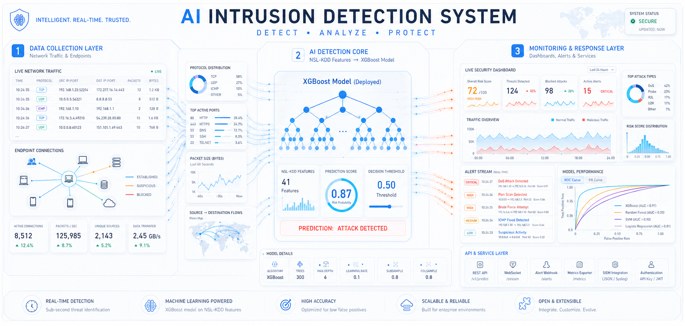
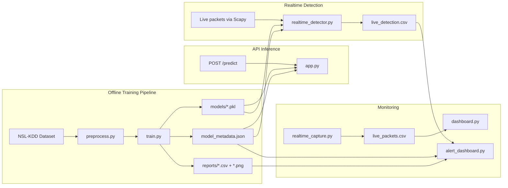
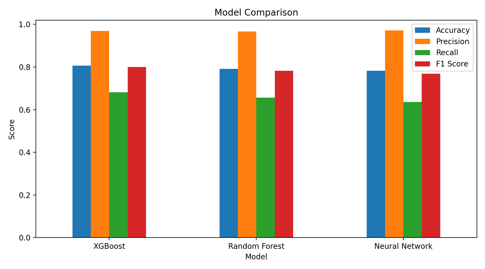
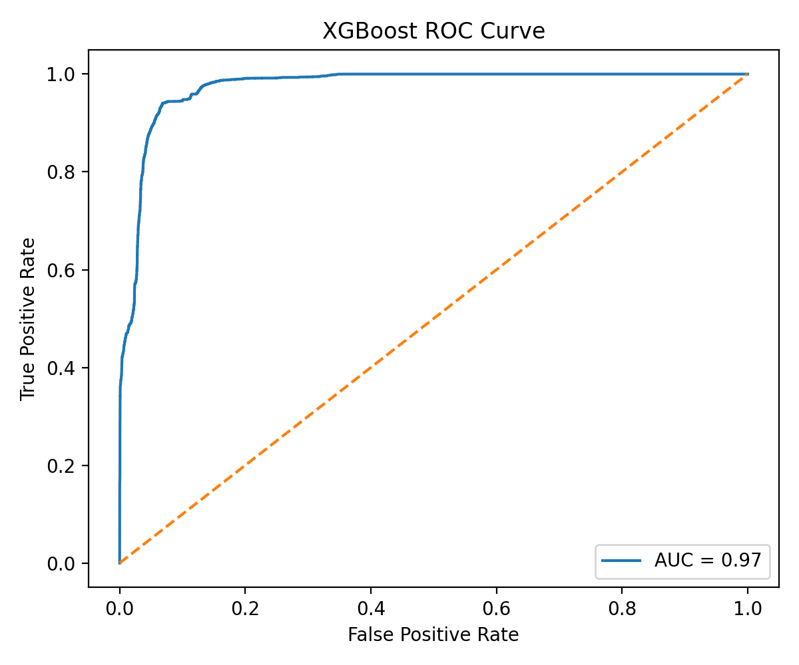
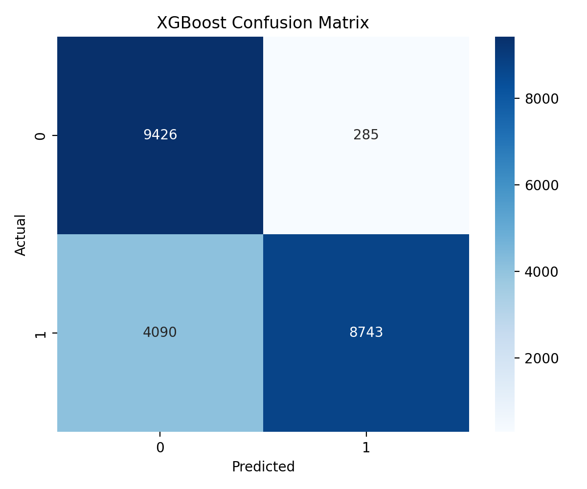
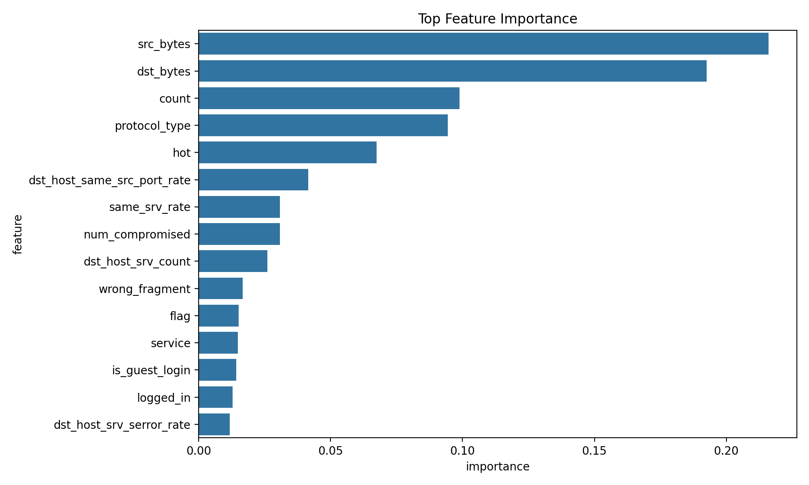
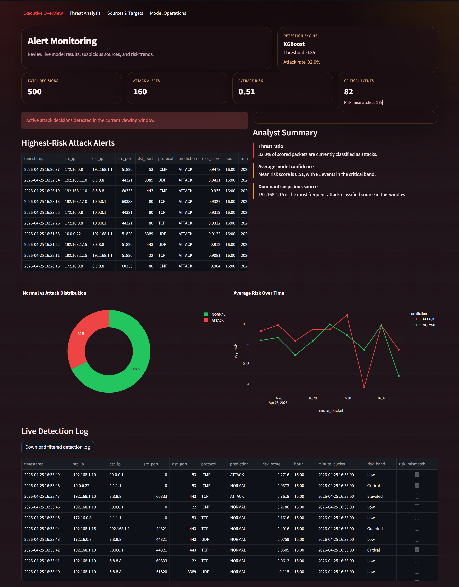
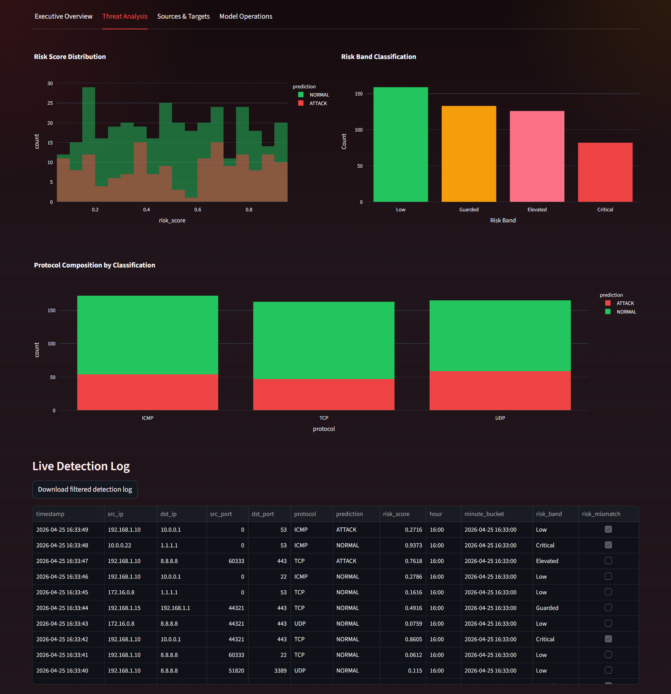
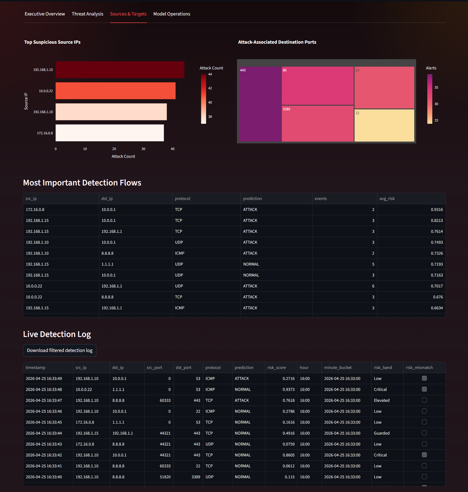
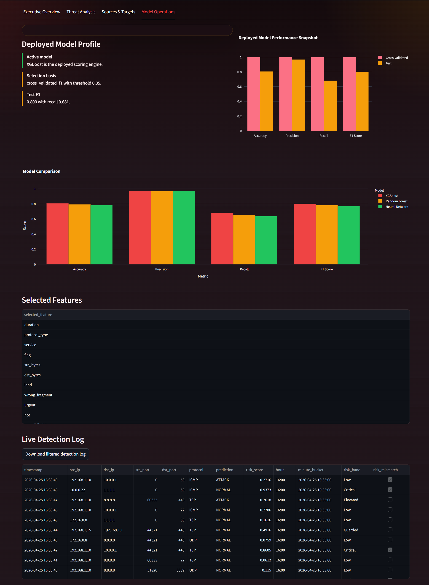

# 🛡️ AI Intrusion Detection System



## 📌 Overview

This project uses the NSL-KDD dataset to train intrusion detection models and expose them through a small deployment stack.

It includes:

- data loading, encoding, scaling, and binary labeling
- model training and threshold tuning across multiple classifiers
- artifact persistence for deployment
- a FastAPI prediction service
- real-time packet scoring with Scapy
- Streamlit dashboards for packet telemetry and alert monitoring
- automated regression tests for the API and runtime loading

The committed deployment metadata currently selects **XGBoost** with a decision threshold of **0.35**.

## ✨ Main Features

- Offline ML pipeline in `src/preprocess.py`, `src/train.py`, and `src/evaluate.py`
- Model comparison across Random Forest, Neural Network, and XGBoost
- Threshold tuning for recall/F1 balance
- FastAPI inference service in `src/app.py`
- Real-time detector in `src/realtime_detector.py`
- Network telemetry dashboard in `src/dashboard.py`
- Alert monitoring dashboard in `src/alert_dashboard.py`
- Structured JSON logging in `src/logging_utils.py`
- PowerShell launch scripts in `scripts/`

## 🧭 Repository Map

| Path | Purpose |
| --- | --- |
| `data/KDDTrain+.txt`, `data/KDDTest+.txt` | NSL-KDD training and evaluation data |
| `src/config.py` | shared constants and project path resolution |
| `src/preprocess.py` | loading, label conversion, encoding, scaling |
| `src/train.py` | cross-validation, tuning, model fitting, artifact export |
| `src/evaluate.py` | evaluation of the selected production model |
| `src/app.py` | FastAPI app with `/`, `/health`, and `/predict` |
| `src/realtime_capture.py` | packet telemetry capture to `reports/live_packets.csv` |
| `src/realtime_detector.py` | live/demo IDS scoring to `reports/live_detection.csv` |
| `src/dashboard.py` | Streamlit dashboard for packet telemetry |
| `src/alert_dashboard.py` | Streamlit dashboard for alerts and model details |
| `src/visualize.py` | plot generation for reports |
| `models/` | saved models, selectors, scaler, encoders, metadata |
| `reports/` | CSV reports, plots, and live runtime outputs |
| `tests/` | API and runtime regression tests |

## 🏗️ System Architecture



> If packet sniffing is unavailable, `src/realtime_detector.py` switches to a demo stream so the alert dashboard can still run.

## 📊 Current Model Snapshot

### 🚀 Deployment Metadata

| Setting | Value |
| --- | --- |
| Selection basis | `cross_validated_f1` |
| Active model | `XGBoost` |
| Active threshold | `0.35` |
| Model artifact | `models/xgboost_model.pkl` |
| Selector artifact | `models/xgboost_selector.pkl` |

### 🏁 Benchmark Summary

| Model | Threshold | Accuracy | Precision | Recall | F1 Score |
| --- | ---: | ---: | ---: | ---: | ---: |
| XGBoost | 0.35 | 0.8059 | 0.9684 | 0.6813 | 0.7999 |
| Random Forest | 0.45 | 0.7915 | 0.9670 | 0.6561 | 0.7818 |
| Neural Network | 0.45 | 0.7818 | 0.9713 | 0.6355 | 0.7683 |

These values come from `reports/model_comparison.csv` and `models/model_metadata.json`.

## 🖼️ Screenshots & Visual Outputs

### 📈 Model Comparison and Evaluation

| Model Comparison | XGBoost ROC Curve |
| --- | --- |
|  |  |

| XGBoost Confusion Matrix | XGBoost Feature Importance |
| --- | --- |
|  |  |

### 🖥️ Dashboard Screens

The project includes two dashboards:

- `src/dashboard.py` for packet telemetry, endpoints, and protocol analysis
- `src/alert_dashboard.py` for alert overview, threat analysis, and model details

#### Alert Dashboard Views

| Executive Overview | Threat Analysis |
| --- | --- |
|  |  |

| Sources & Targets | Model Operations |
| --- | --- |
|  |  |

## 🚀 Getting Started

### 1. Prerequisites

- Python 3.13.1 was used in the validated environment
- Windows PowerShell for the included launcher scripts
- `pip` for dependency installation
- Npcap with WinPcap compatibility for live sniffing on Windows

### 2. Install Dependencies

```bash
pip install -r requirements.txt
```

### 3. Train the Models

```bash
python src/train.py
```

This generates:

- serialized models and preprocessors in `models/`
- tuning results in `reports/tuning_results.csv`
- comparison metrics in `reports/model_comparison.csv`
- plot outputs in `reports/*.png`

### 4. Evaluate the Selected Production Model

```bash
python src/evaluate.py
```

## 🔌 Run the Application Stack

### FastAPI Service

```bash
uvicorn src.app:app --reload
```

Open `http://127.0.0.1:8000/docs`.

### Realtime Detector

```powershell
.\scripts\run_detector.ps1
```

This loads the active deployed model from `models/model_metadata.json` and writes scored events to `reports/live_detection.csv`.

### Alert Dashboard

```powershell
.\scripts\run_alert_dashboard.ps1
```

### Packet Capture Telemetry

Start packet capture:

```bash
python src/realtime_capture.py
```

Then open the telemetry dashboard:

```bash
python -m streamlit run src/dashboard.py
```

## 🔍 API Reference

### `GET /`

Returns service availability plus active model metadata.

### `GET /health`

Returns runtime readiness and any artifact-loading error.

### `POST /predict`

Accepts a JSON payload with exactly **41 numeric features**:

```python
payload = {"features": [0.0] * 41}
```

> The payload must contain all 41 values in NSL-KDD feature order. The API applies scaling and feature selection internally, but categorical fields must already be integer encoded before submission. For raw packet ingestion, use `src/realtime_detector.py`.

## 🧪 Testing

Run the automated test suite with:

```bash
python -m pytest -q
```

or:

```bash
python -m unittest discover -s tests -q
```

The current tests cover:

- API health and metadata exposure
- prediction payload validation
- runtime state reset on artifact-loading failure
- detector alignment with the selected production model

## 📁 Key Runtime Outputs

| File | Produced By | Description |
| --- | --- | --- |
| `models/model_metadata.json` | `src/train.py` | active production model metadata and per-model metrics |
| `models/scaler.pkl` | `src/train.py` | saved feature scaler |
| `models/encoders.pkl` | `src/train.py` | saved categorical encoders |
| `models/*_model.pkl` | `src/train.py` | trained classifier artifacts |
| `models/*_selector.pkl` | `src/train.py` | feature selector artifacts |
| `reports/tuning_results.csv` | `src/train.py` | cross-validation and threshold tuning results |
| `reports/model_comparison.csv` | `src/train.py` | final model benchmark table |
| `reports/live_detection.csv` | `src/realtime_detector.py` | scored live/demo IDS events |
| `reports/live_packets.csv` | `src/realtime_capture.py` | raw packet telemetry log |

## ⚠️ Notes and Limitations

- The API does not accept raw network packets or categorical strings directly.
- The real-time detector uses approximate NSL-KDD-style feature derivation from live packets.
- Live sniffing depends on local packet-capture support and administrator permissions.
- The dashboards depend on the presence of runtime CSV files in `reports/`.

## 🛠️ Tech Stack

- Data/ML: pandas, NumPy, scikit-learn, XGBoost
- API: FastAPI, Pydantic, Uvicorn
- Realtime capture: Scapy
- Dashboards: Streamlit, Plotly
- Visualization: Matplotlib, Seaborn
- Testing: pytest, unittest

## 📚 Project Summary

This repository includes:

- an offline training workflow
- persisted deployment artifacts
- an online prediction API
- a live scoring pipeline
- dashboards for telemetry and alerts
